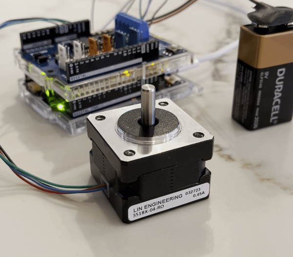

# Stepper Control
This code implements the control of a motor for use in robotics projects. The chosen motor type is a hybrid bipolar stepper motor - it acheives accurate and repeatable movement, yields a high holding torque, allows continuous motion, and lacks the requirement of a feedback loop.

Bipolar steppers are among the most powerful and repeatable motor types. However, bipolar stepper motors are more difficult to control than other steppers and much more difficult to control than DC motors. This repository acts as a study of bipolar stepper motors, and how to control them.

&nbsp;

<div align="center"></div>

&nbsp;

## Hardware
- `Arduino R4`: the microcontroller that the code runs on 
- `Arduino motor carrier Rev3`: acts as the driver, delivers more power than the Arduino is capable of.
- `NEMA 17 hybrid bipolar stepper`: 1.8° Step Angle, 42.48 oz-in Holding Torque
- `9 volt battery`: The motor is powered by a 9 volt battery

&nbsp;

## Motor Specs
The NEMA motor used here has 200 steps per revolution which results in a step size of 1.8 degrees. Finer step resolutions are acheivable when **microstepping**, but at the cost of lowering torque. 

The motor has two pairs of wires corresponding with two coils, often noted as A and B.

&nbsp;

# Control methods

&nbsp;

## Single phase stepping
Single phase stepping is the simplest way to control a stepper motor, but despite its relative simplictiy, it still takes a set of four precicesly timed signals to complete a motor step.
The activation pattern for a single phase step is (A+ > B+ > A- > B-) ; where the sign notes the current direction. 

In other words:
To make a bipolar motor complete one full step:
 - Power the first coil.
 - Next power the second coil with reverse polarity.
 - Then power the first coil with reverse polarity.
 - Finally, power the second coil.
To reverse the motor direction of a bipolar stepper, simply reverse the polarity of the second coil.

&nbsp;

## Full stepping 
Full stepping provdes the highest torque when controlling a stepper motor because it utilizes simultaneous coil activations - which results in a greater magnetic field and thus a greater attraction force. However, full stepping is more complicated to implement than single phase stepping. Additionally, full stepping produces more vibration than partial stepping. 
The activation pattern for one full step is (A+B+ > A-B+ > A-B- > A+B-).

&nbsp;

## Half stepping
Full stepping uses the full power of each coil, while half stepping uses partial activation to cut the repeatable steps from 1.8 degrees to 0.9 degrees. In the process, holding torque is sacrificed. 

Half stepping, a type of partial or micro stepping, creates less vibration and results in smoother motion than full stepping. However, when half stepping the torque is lower than full stepping and additionally the algorithm is twice as long as full stepping.
The coil activation pattern for a half step is (AB > B > A-B+ > A- > A-B- > B- > A+B- > A).

&nbsp;

## Quarter stepping
Quarter stepping, and every further incrementation is called partial stepping or microstepping. With further microstepping, the control algorithm doubles in length, occupying the microcontroller's brain with further instructions and providing diminishing returns in reducing vibrations. 

&nbsp;

## Sinusoidal stepping
Sinusoidal stepping takes microstepping to the extreme. The currents constantly change according to sinusoidal waves.
Using sinusoidal stepping: 
- The current in channel A: Ia = Imax * cos(theta)
- The current in channel B: Ib = Imax * sin(theta)
In practice, this method generates the smoothest possible motion but requires hardware capable of generating continuous varrying current, which is much more expensive than some level of microstepping, which can use a purely digital system rather than an analog one.

&nbsp;

## Sources
[Randofo / instructables.com](https://www.instructables.com/Arduino-Motor-Shield-Tutorial/)
[Monolithic Power Systems](https://www.monolithicpower.com/bipolar-stepper-motors-part-ii-microstepping-and-decay-modes)

&nbsp;

## Repository Structure
```
repository/
├── stepper_forward/
│   └── stepper_forward.ino
└── docs/
    └── preview.png # preview photo for Github
```

&nbsp;

## Topics 
```
Arduino | Git | Motor control | Stepper motor | Hardware 
Self taught coding | Mechanical engineer | Robotics engineer | Brian Joseph Lesko | Brian Lesko
```
&nbsp;

<hr>

&nbsp;

<div align="center">


╭━━╮╭━━━┳━━┳━━━┳━╮╱╭╮        ╭╮╱╱╭━━━┳━━━┳╮╭━┳━━━╮
┃╭╮┃┃╭━╮┣┫┣┫╭━╮┃┃╰╮┃┃        ┃┃╱╱┃╭━━┫╭━╮┃┃┃╭┫╭━╮┃
┃╰╯╰┫╰━╯┃┃┃┃┃╱┃┃╭╮╰╯┃        ┃┃╱╱┃╰━━┫╰━━┫╰╯╯┃┃╱┃┃
┃╭━╮┃╭╮╭╯┃┃┃╰━╯┃┃╰╮┃┃        ┃┃╱╭┫╭━━┻━━╮┃╭╮┃┃┃╱┃┃
┃╰━╯┃┃┃╰┳┫┣┫╭━╮┃┃╱┃┃┃        ┃╰━╯┃╰━━┫╰━╯┃┃┃╰┫╰━╯┃
╰━━━┻╯╰━┻━━┻╯╱╰┻╯╱╰━╯        ╰━━━┻━━━┻━━━┻╯╰━┻━━━╯
  


&nbsp;


<a href="https://twitter.com/BrianJosephLeko"></a> &nbsp; &nbsp; &nbsp; &nbsp; &nbsp; &nbsp; <a href="https://github.com/BrianLesko"></a> &nbsp; &nbsp; &nbsp; &nbsp; &nbsp; &nbsp; <a href="https://www.linkedin.com/in/brianlesko/"></a>

follow all of these or i will kick you

</div>


&nbsp;


